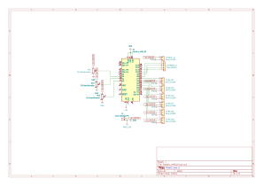
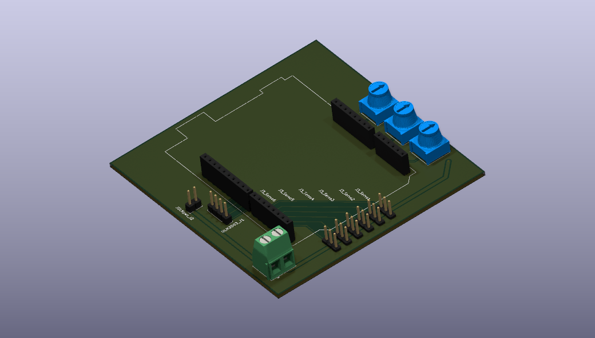
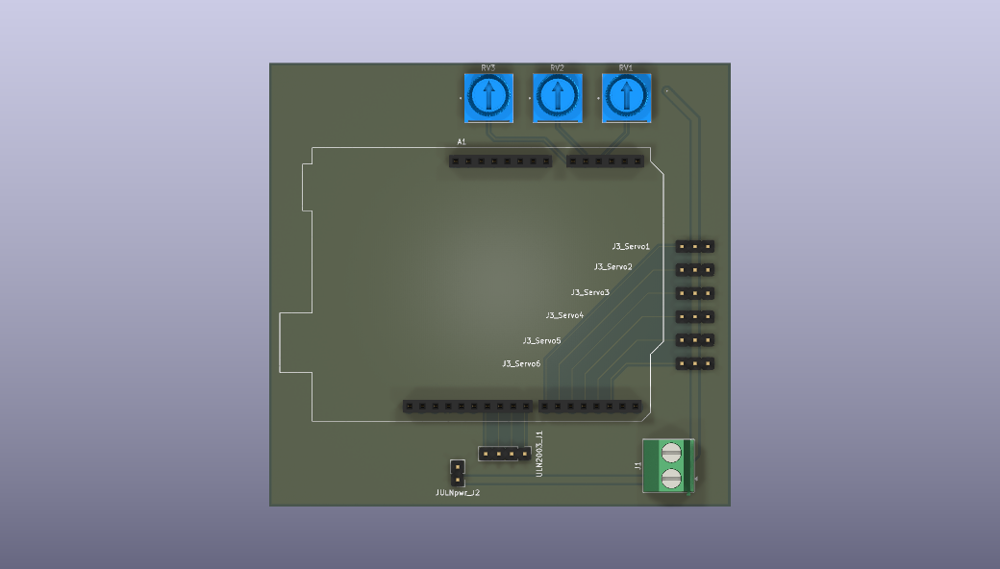

# 6-DOF Robotic Hand with Rotating Base

A custom 3D-printed 6 Degree-of-Freedom (DOF) robotic hand project controlled by an Arduino Uno, custom PCB shield, micro servos, and a 28BYJ-48 stepper motor base assembly.

---

## Overview

This project features an **Arduino Uno Shield PCB** designed in KiCad to route dedicated power to actuators and test multi-servo control alongside stepper base rotation. It supports dual control via onboard potentiometers and USB Serial commands.

*Note: The PCB design has passed KiCad ERC/DRC checks, but physical board fabrication and hardware verification are currently pending.*

### Key Features
* **Hand Actuation:** Individual finger actuation + wrist/palm tilt servo.
* **Base Rotation:** Driven by a 28BYJ-48 stepper motor via an integrated ULN2003 driver interface.
* **Custom PCB Shield:** Integrates external DC power terminals, 3-pin servo headers, stepper outputs, and 3 control potentiometers onto an Arduino shield.
* **Control Modes:** Manual potentiometer positioning alongside a 115200 baud UART Serial Command Interface (`1o`/`1c` through `5o`/`5c`, `R`).

---

## Known Issues & Current Limitations

This build is an active prototype with several physical and mechanical limitations:

* **Finger Stuttering:** Jitter or stuttering occurs during finger motion due to power distribution noise and line friction.
* **Servo Mount Placement:** The physical servo mounting bracket is currently a prototype iteration and requires CAD dimensional adjustments for better alignment.
* **Tendons & Return Mechanism (Single-Line Cable Setup):** Fingers are pulled closed using a fishing line tendon routed to the servo and returned using elastic bands. Because of this tension mechanism, finger movement is not fully independent or rigid.
* **Future Mechanism Upgrade:** The mechanical setup is planned to be updated to a direct antagonist/pulley assembly (where dynamic 0° to 180° rotation directly pulls the finger closed, and reversing the rotation drives the joint fully open).

---

## Repository Structure

* **CAD/** — 3D Printable STL Files (`All_Fingers.stl`, `Hand_Palm.stl`, `servo_mount.stl`, etc.)
* **Firmware/** — Arduino MCU C++ Code (`Hand_Code_Final.ino`)
* **PCB/** — KiCad PCB Files, Schematics & Renders (`Hand_gerbers.zip`, `Robotic_HAND.png`, `Robotic_HAND_schematic.svg`)
* **LICENSE**
* **README.md**

---

## Hardware & Bill of Materials 

### Electronics & Components
| Component | Quantity | Connection / Function |
| :--- | :--- | :--- |
| **Arduino Uno R3** | 1 | Primary Microcontroller |
| **Micro Servos (SG90 / MG90S)** | 6 | Pins 2–7 (Pinky, Ring, Middle, Index, Thumb, Palm) |
| **28BYJ-48 Stepper Motor** | 1 | Pins 8, 9, 10, 11 (Base Rotation) |
| **ULN2003 Driver Module** | 1 | Connects to `ULN2003_J1` & `JULNpwr_J2` PCB headers |
| **Trimmer Potentiometers** | 3 | Onboard inputs `RV1` (A0), `RV2` (A1), `RV3` (A2) |
| **2-Pin Screw Terminal (`J1`)** | 1 | Dedicated external DC supply input for actuators |
| **Custom Arduino Shield PCB** | 1 | Custom 2-layer power & signal routing PCB |
| **Pin Headers (Male & Female)** | Assorted | Component, servo, and Arduino connections |
| **Fishing Line (Monofilament)** | Spool | Tension cable for flexion pulling mechanism |
| **Elastic Bands** | Assorted | Passive return tension for finger extension |

---

## Hardware Schematics & PCB Design

The custom shield routes actuator power (`+5V_MOTOR`) separately from the logic supply to avoid microcontroller reset loops during multi-servo movement.

### Schematic

### Board Layout & 3D Renders
| Isometric View | Top View |
| :---: | :---: |
|  |  |

---

## Software & Control Logic

The primary controller code is located at `/Firmware/Hand_Code_Final.ino`.

### Serial Commands (115200 Baud)

Open the Arduino Serial Monitor at **115200 baud** to issue positional commands:

| Command | Action | Command | Action |
| :--- | :--- | :--- | :--- |
| `1o` / `1c` | Pinky Open / Close | `4o` / `4c` | Index Open / Close |
| `2o` / `2c` | Ring Open / Close | `5o` / `5c` | Thumb Open / Close |
| `3o` / `3c` | Middle Open / Close | `R` or `r` | **Reset All** (All servos to default) |

---

## Getting Started

1. **Assemble Hardware:** Print the components from `/CAD` and mount the custom PCB shield onto your Arduino Uno.
2. **Power Supply:** Connect an external 5V 2A DC power source to terminal block `J1` to power the servos separately.
3. **Upload Firmware:** Open `/Firmware/Hand_Code_Final.ino` in the Arduino IDE, select **Arduino Uno**, choose your COM port, and click **Upload**.

---

## License

Distributed under the MIT License. See `LICENSE` for details.
